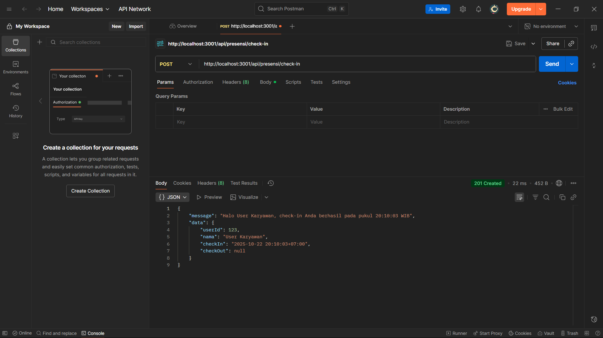
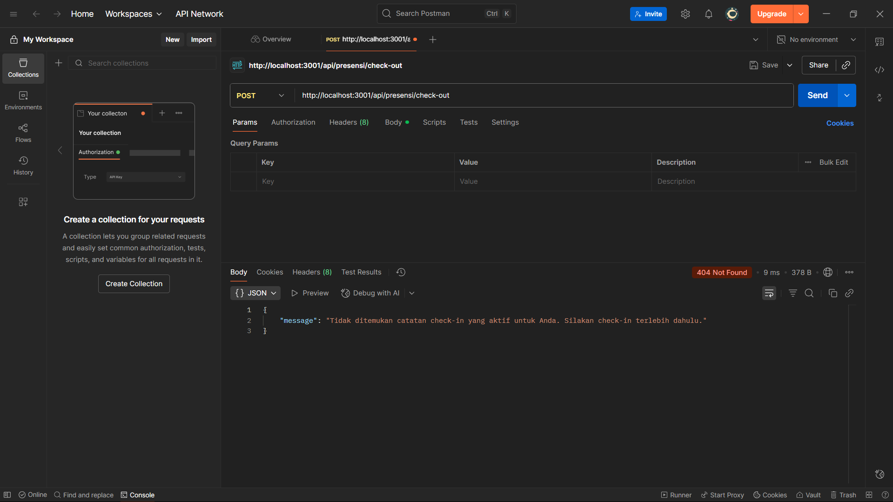

# 📂 Dokumentasi Proyek Aplikasi

Selamat datang di dokumentasi visual untuk proyek aplikasi ini. 
Berikut adalah panduan langkah demi langkah dan tampilan utama dari fitur Check-in, Check-out, dan Laporan Harian.

---

## 1. Proses Check-in

Bagian ini menunjukkan langkah-langkah yang diperlukan untuk memulai sesi kerja.

### 1.1. Tampilan Awal Check-in

Tampilan ini adalah halaman pertama yang dilihat pengguna saat memulai proses Check-in.

### 1.2. Konfirmasi Check-in

Setelah mengisi data atau menekan tombol, tampilan ini muncul untuk mengonfirmasi bahwa proses Check-in telah berhasil dicatat, dan proses check in dilakukan lebih dari satu kali

---

## 2. Proses Check-out

Bagian ini menunjukkan cara pengguna mengakhiri sesi kerja mereka.

### 2.1. Tampilan Awal Check-out

Tampilan ini adalah halaman yang digunakan pengguna untuk mengakhiri sesi mereka.

### 2.2. Konfirmasi Check-out

Tampilan ini memberikan ringkasan waktu kerja dan mengonfirmasi penyelesaian proses Check-out, dan proses check out dilakukan lebih dari satu kali

---

## 3. Laporan Harian (Daily Report)

Bagian ini menampilkan ringkasan aktivitas atau laporan yang dihasilkan setiap hari.

---
