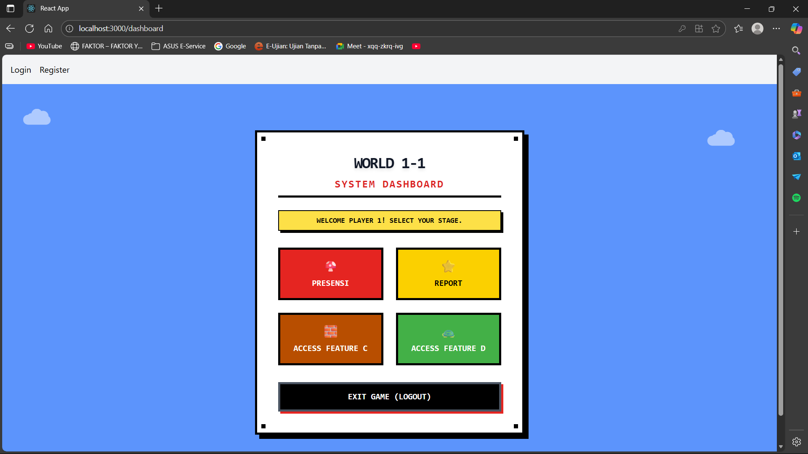

# 📝 Laporan Tugas 7: Implementasi Desain Antarmuka Baru

Dokumen ini berisi hasil pelaksanaan dan *screenshot* untuk **Tugas 7**, yang berfokus pada pembaruan desain antarmuka (UI) aplikasi dengan tema baru dan alur navigasi pengguna.

---

## 1. Tampilan Halaman Login 🔐

Bagian ini menunjukkan tampilan antarmuka (UI) untuk halaman masuk pengguna (Login Page).

### Hasil Tampilan Login

**Keterangan:**
* Gambar **`login.png`** memperlihatkan desain halaman otentikasi utama.
* Halaman ini memfasilitasi pengguna (Mahasiswa/Admin) untuk memasukkan kredensial sebelum mengakses fitur utama dashboard.

---

## 2. Tampilan Halaman Registrasi 📝

Bagian ini menunjukkan tampilan antarmuka (UI) untuk proses pendaftaran akun baru.

### Hasil Tampilan Registrasi

**Keterangan:**
* Gambar **`register.png`** menampilkan formulir untuk pembuatan akun baru.
* Fitur ini memungkinkan pengguna memilih peran (role) dan mendaftarkan data diri ke dalam sistem database.

---

## 3. Tampilan Dashboard Utama 🖥️

Bagian ini menunjukkan tampilan antarmuka (UI) halaman utama setelah pengguna berhasil masuk.

### Hasil Tampilan Dashboard

**Keterangan:**
* Gambar **`dashboard.png`** memperlihatkan menu utama sistem.
* Halaman ini berfungsi sebagai pusat navigasi untuk mengakses fitur-fitur aplikasi lainnya serta tombol *logout*.

---

**Selesai.**