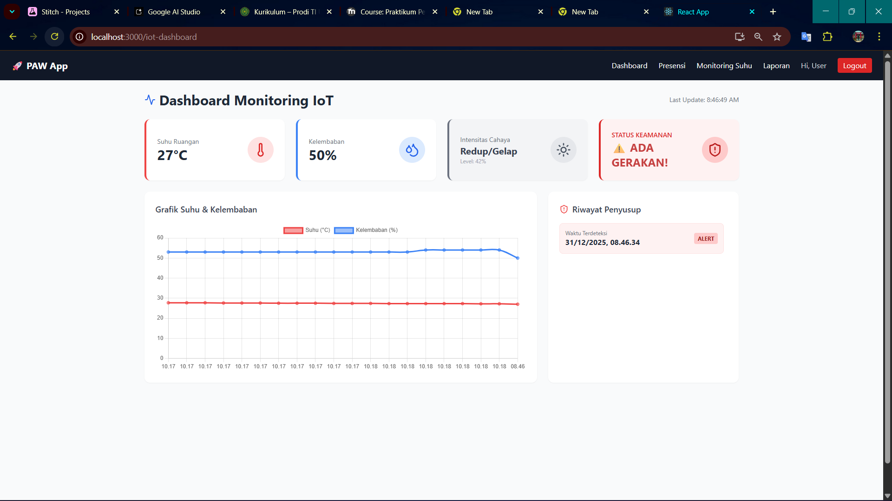
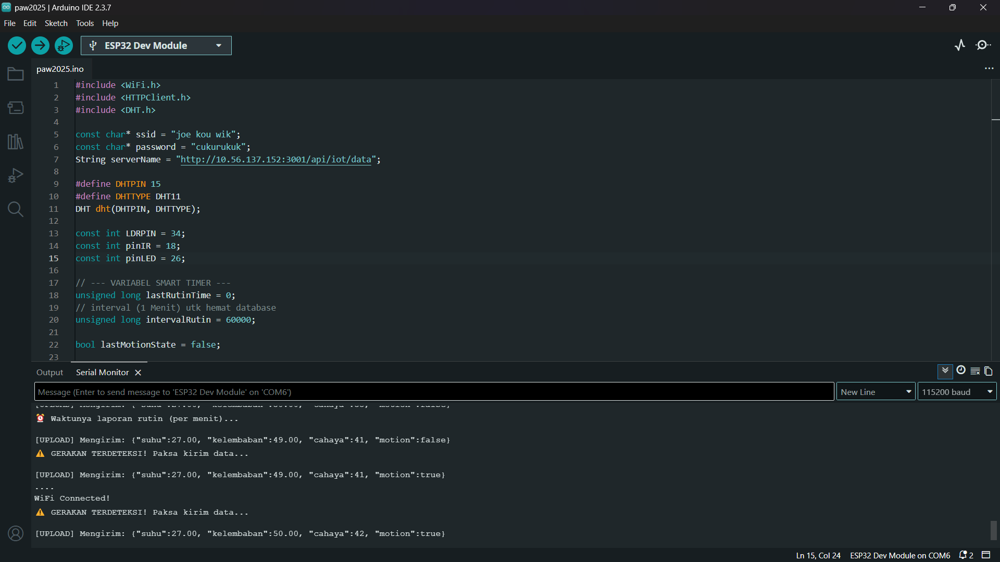
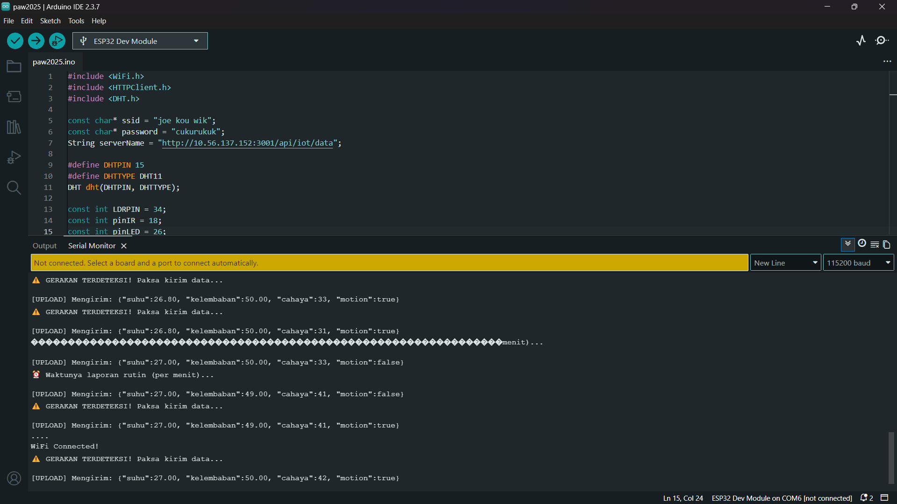
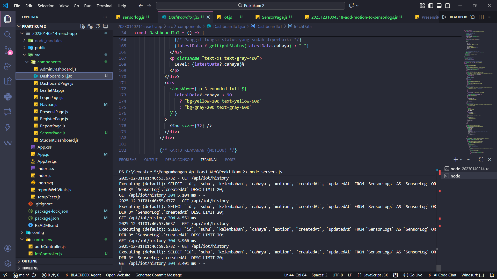
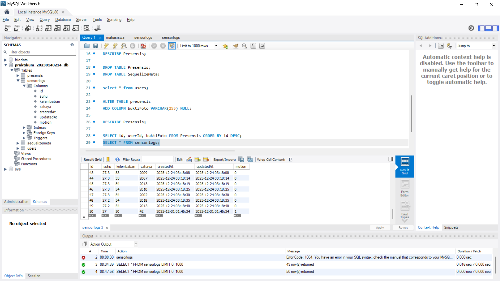

# 📘 Dokumentasi Tugas

1. **Tampilan Dashboard Saat Alert Gerakan Muncul**  
   

2. **Tampilan Source Code Arduino (Konfigurasi)**  
   

3. **Tampilan Serial Monitor Saat Ada Gerakan**  
   

4. **Tampilan Log Terminal Server & Logic React**  
   

5. **Tampilan Databse**  
   