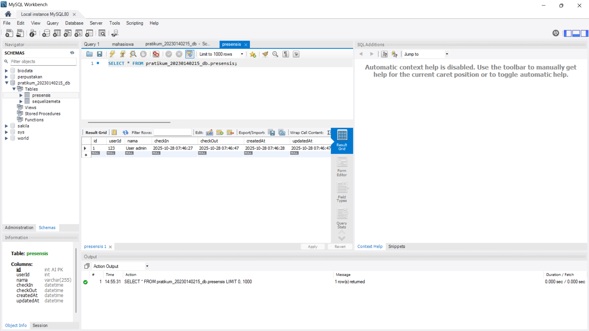
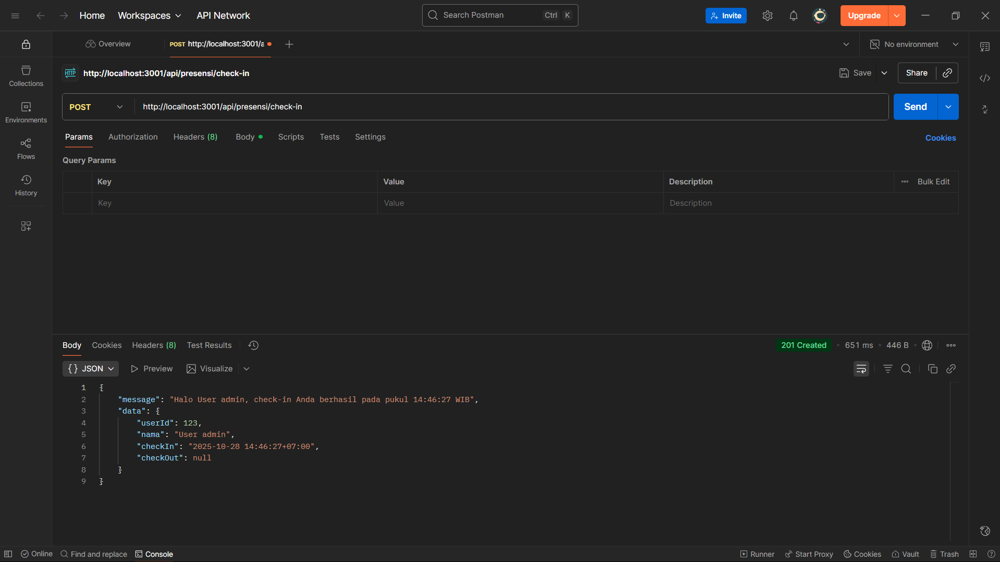
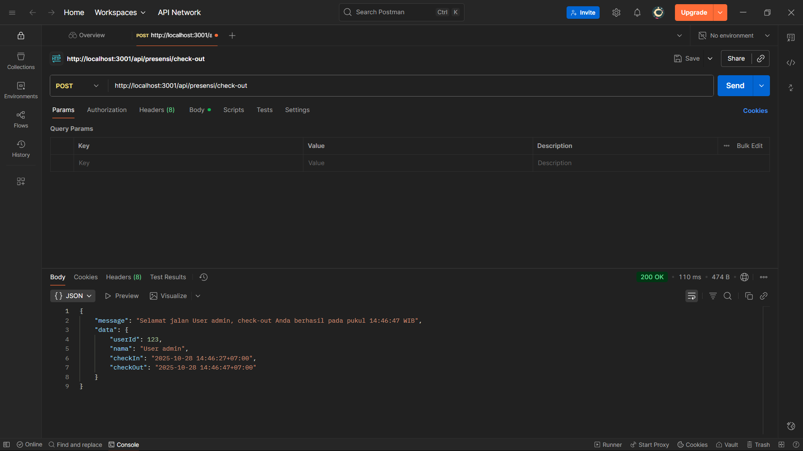
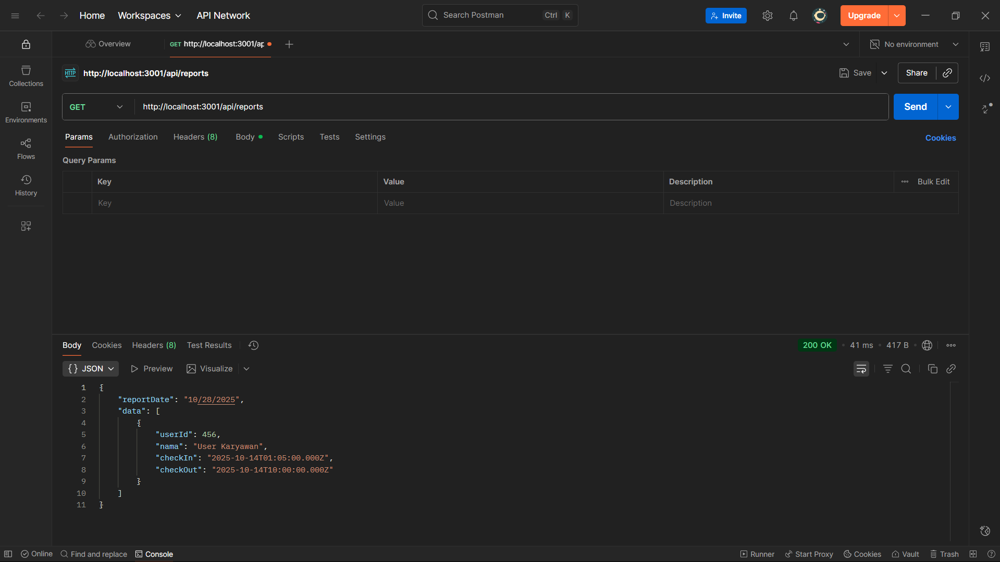

# 📝 Laporan Tugas 4: Integrasi Database dan Laporan Presensi

Dokumen ini berisi hasil pelaksanaan dan *screenshot* untuk Tugas 4, yang berfokus pada integrasi database (Sequelize) dan implementasi fitur presensi (Check-in/Check-out) serta laporan.

---

## 1. Skema Database

Bagian ini menunjukkan struktur tabel database setelah migrasi Sequelize berhasil dijalankan.

### Hasil Database

**Keterangan:**
* **Tabel `Presensi`** telah berhasil dibuat sesuai dengan model yang didefinisikan, mencakup kolom seperti `userId`, `nama`, `checkIn`, `checkOut`, `createdAt`, dan `updatedAt`.
* Tabel lain yang relevan (`Users`, dsb.) juga sudah tersedia dan terhubung (jika ada).

---

## 2. Fitur Presensi: Check-in

Bagian ini menunjukkan hasil pengujian fitur *check-in* melalui Postman.

### Pengujian Check-in

**Keterangan:**
* *Endpoint* yang diakses: `POST /api/presensi/check-in`
* Status *response*: **201 Created**.
* Pesan yang diterima mengonfirmasi bahwa *check-in* berhasil dilakukan pada waktu tertentu.
* Data di database mencatat waktu `checkIn` dan `checkOut` masih `NULL`.

---

## 3. Fitur Presensi: Check-out

Bagian ini menunjukkan hasil pengujian fitur *check-out* melalui Postman setelah *check-in* berhasil dilakukan.

### Pengujian Check-out

**Keterangan:**
* *Endpoint* yang diakses: `POST /api/presensi/check-out`
* Status *response*: **200 OK**.
* Pesan yang diterima mengonfirmasi bahwa *check-out* berhasil dilakukan.
* Data di database diperbarui, dan kolom `checkOut` sekarang terisi dengan waktu *check-out* yang valid.

---

## 4. Fitur Laporan (Reports)

Bagian ini menunjukkan hasil pengujian fitur pengambilan laporan presensi harian/keseluruhan melalui Postman.

### Pengujian Laporan

**Keterangan:**
* *Endpoint* yang diakses: `GET /api/reports/daily` (atau endpoint laporan yang relevan).
* Status *response*: **200 OK**.
* Data yang ditampilkan mencakup semua rekaman presensi yang tersimpan di database, memverifikasi fungsionalitas laporan.

---

**Selesai.**