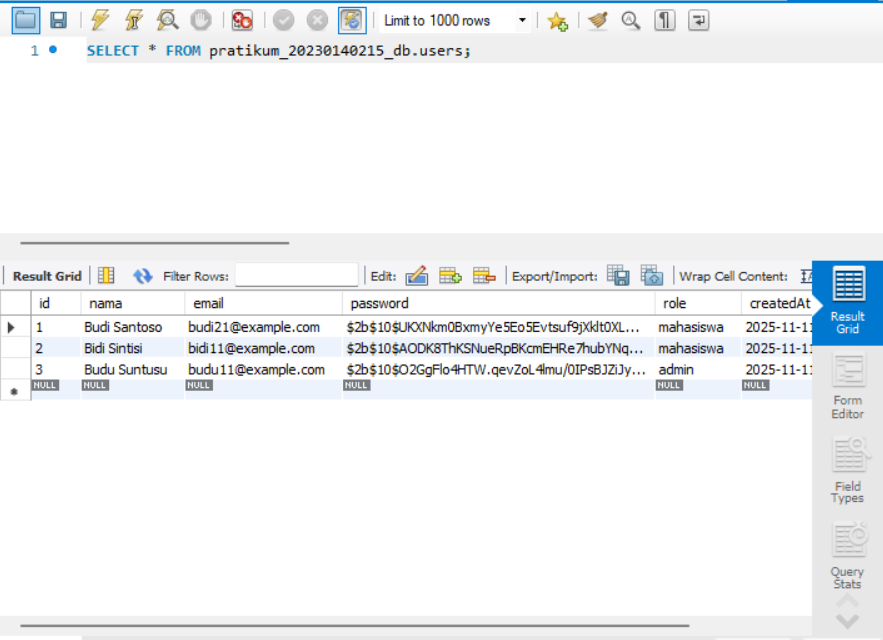
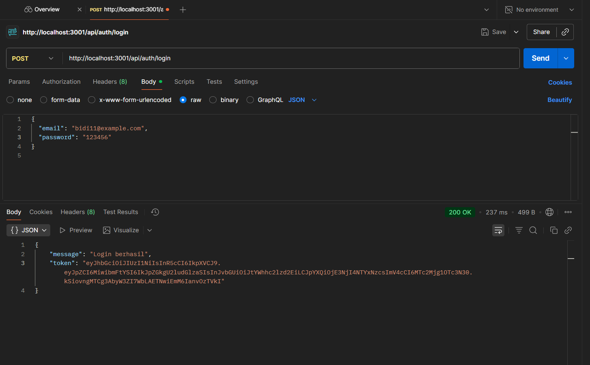
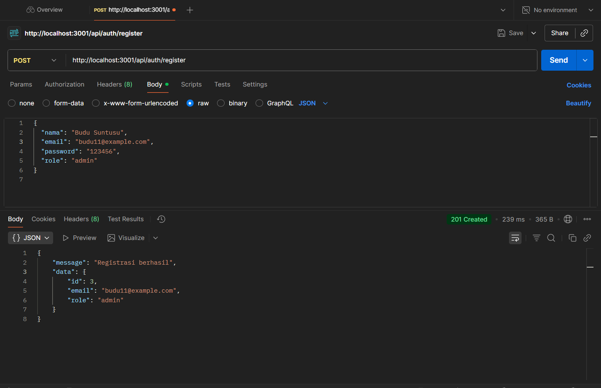

# 📝 Laporan Tugas 6: Tampilan Antarmuka (UI) Aplikasi

Dokumen ini berisi hasil pelaksanaan dan *screenshot* untuk **Tugas 6**, yang berfokus pada pengembangan dan tampilan antarmuka (UI) untuk beberapa modul utama aplikasi.

---

## 1. Skema Database Visual (Opsional) 💾

Bagian ini menampilkan diagram atau skema visual yang merepresentasikan struktur database yang digunakan dalam aplikasi.

### Hasil Skema Database

**Keterangan:**
* Gambar **`database.png`** menunjukkan representasi visual dari struktur tabel dan relasi dalam database aplikasi.
* Ini memverifikasi desain database yang menjadi fondasi fitur-fitur yang ada.

---

## 2. Tampilan Login Mahasiswa 🧑‍🎓

Bagian ini menunjukkan tampilan antarmuka (UI) untuk halaman *Login* yang digunakan oleh Mahasiswa.

### Hasil Tampilan Login Mahasiswa

**Keterangan:**
* Gambar **`LoginMahasiswa.png`** memperlihatkan desain dan elemen-elemen yang tersedia pada halaman *login* untuk peran Mahasiswa.
* Halaman ini berfungsi untuk otentikasi Mahasiswa sebelum mengakses sistem.

---

## 3. Tampilan Registrasi Admin 👨‍💻

Bagian ini menunjukkan tampilan antarmuka (UI) untuk proses pendaftaran akun *Admin* baru.

### Hasil Tampilan Registrasi Admin

**Keterangan:**
* Gambar **`RegistrasiAdmin.png`** menampilkan *form* dan tampilan untuk registrasi pengguna dengan peran Admin.
* Tampilan ini memastikan bahwa Admin dapat didaftarkan ke dalam sistem.

---

## 4. Tampilan Registrasi Mahasiswa 📝

Bagian ini menunjukkan tampilan antarmuka (UI) untuk proses pendaftaran akun *Mahasiswa* baru.

### Hasil Tampilan Registrasi Mahasiswa

**Keterangan:**
* Gambar **`RegistrasiMahasiswa.png`** menampilkan *form* dan tampilan untuk registrasi pengguna dengan peran Mahasiswa.
* Tampilan ini memungkinkan Mahasiswa baru untuk mendaftar dan membuat akun.

---

**Selesai.**